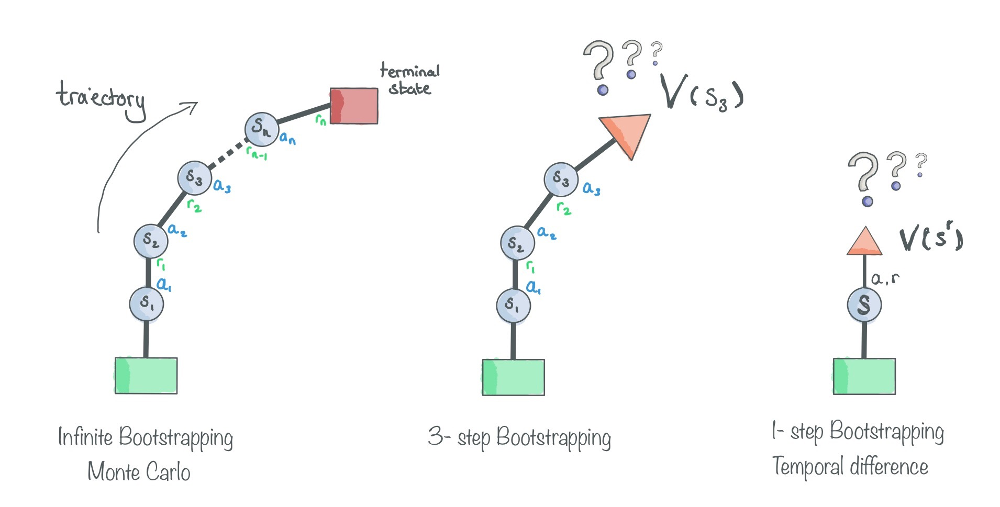

# Policy Gradients

#### What is a Policy?
A policy is a set of probabilities distributions to what action to take in a given state. 

#### What is the Objective of a Policy Gradient?
To maximise the expected reward. Essentially it tries to make actions which are more likely to deliver high rewards.

## Actor Critic

Policy gradient based methods update the policy based on how the agent has played. It will try and increase the probability of taking good actions and reduce the probability of taking bad actions. Unlike value based methods, which estimate the value of a state, and then choose the best action, policy based methods can handle continuous actions spaces (though also discrete by adding a argmax).

There are several ways of getting the experiences to update the agent with. In the REINFORCE algorithm a monte-carol approach is taken. We let the agent play out an entire game, and then work out what the expected reward was. This will have low bias, because they will be all true events, however high variability because they might lead to completely different outcomes.

A in-between method is to use a value-based approach to guess how much the following steps are worth. For example, you might let the agent take 2 steps and then guess what the expected reward would be. This will then allow you to update the policy. However, because you’re making a guess, you’ll probably have a high bias, because we do not know what a good state is yet. on the flip side, we’ll have low variance as what we think is a good state now we’ll likely also still find a good state later. This means we end up training the agent faster and has less problem converging.

Actor critic is a method where there are two neural networks within the agent:

- **Actor**: This network makes the decisions on what action to take
- **Critic**: This network decides HOW good an action is.

To illustrate this, consider the following example:

  

If you have an agent which is learning to run as fast as possible and ends up with a score of 11 (seconds to run to the finish line). Then how good is this? Is it the fastest every run because the distance was 1km or is it terrible because it only had to run 10m. This is the job of the critic to decipher, by looking at the past experiences it works out on average how good or bad an action is.

Over time the we’ll learn what a good value state is. This is what the actor citric method is. The actor makes the decisions and the critic tells us how good or bad those actions will be in the future.

## N-step Bootstrapping

There are many different ways on how to estimate what the future reward from a given state is going to look like. Below are three main categories in which they can fall.

  

1. The first method is a infinite-bootstrap, essentially Monte Carlo. The algorithm plays out the entire episode and looks at what the reward is. This means that estimate of the reward isn't really an estimate but the exact answer. The problem with this method is that it takes long to compute and has a very high varience. That is to say, if the algorithm were to play the scene out again, there is a large change that the new reward would be different. This can be combated by playing many episode with the same policy, and averaging the reward (as is done with the REINFORCE algorithm), however this is computationly very expensive, especially if it's a large game. Moreover, as number of states the agent can enter increase the agent is likely to enter states it hasn't seen before and will not know what to do.

2. The second method uses a ***value function*** to estimate the value of a given state. Instead of computing the entire episode to be able to train, the agent can now use the value function as a substitute. The problem here of course is that the value function needs to be honed over time. This method will have a low variance, as when an agent enters a similar or same state, it will likely view it as having the same value as before. On the flip side it will also have a high bias, as the value function will not be entirely correct of predicting what the final reward will be.

3. Lastly we have a happy middle ground, taking a few steps means that the variance should stay low, as these are actions we're taking in the real world. However after 'n' steps, we use the value function to finish of the estimate of what the final reward will be.