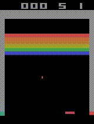

# rl_lib 

**Motivation:** I have always thought that the only way to truely test if you understand a concept is to see if you can build it. As such all these these algorithms are implemented studying the relevant papers and coded to test my understanding.

> What I cannot create, I do not understand” - Richard Feynman

## Algorithms

### DQN
- **Vanilla DQN**
  - Paper: [Human-level control through deep reinforcement learning](https://storage.googleapis.com/deepmind-data/assets/papers/DeepMindNature14236Paper.pdf)
- **Noisy DQN**
  - Paper: [Noisy Networks for Exploration](https://arxiv.org/pdf/1706.10295.pdf)
- **Dualing DQN**
  - Paper: [Dueling Network Architectures for Deep Reinforcement Learning](https://arxiv.org/pdf/1511.06581.pdf)
- **Double DQN**
  - Paper: [Deep Reinforcement Learning with Double Q-learning](https://arxiv.org/pdf/1509.06461.pdf)
- **Prioritiesed Experience Replay DQN**
  - Paper: [Prioritized Experience Replay](https://arxiv.org/pdf/1511.05952.pdf)
- **Rainbow DQN**
  - Paper: [Rainbow: Combining Improvements in Deep Reinforcement Learning](https://arxiv.org/pdf/1710.02298.pdf)

### Policy Gradient
- **Advantage Actor Critic (A2C) - single environment**
  - Paper: [Asynchronous Methods for Deep Reinforcement Learning](https://arxiv.org/pdf/1602.01783.pdf)
- **Advantage Actor Critic (A2C) - multi environment**
  - Paper: [Asynchronous Methods for Deep Reinforcement Learning](https://arxiv.org/pdf/1602.01783.pdf)
- **Deep Deterministic Policy Gradients**
  - Paper: [Continuous Control with Deep Reinforcement Learning](https://arxiv.org/pdf/1509.02971.pdf)
- **Proximal Policy Optimisation (discrete and continuous)**
  - Paper: [Proximal Policy Optimization Algorithms](https://arxiv.org/pdf/1707.06347.pdf)

### Tabular Solutions
These were mainly referenced from a really good lecture series by Colin Skow on youtube [[link]](https://www.youtube.com/watch?v=14BfO5lMiuk&list=PLWzQK00nc192L7UMJyTmLXaHa3KcO0wBT). A large part was also found in the Deep Reinforcement Learning Udacity course.

- **Bellman Equation**
- **Dynamic Programming**
- **Q learning**

## Results

### DQN Pong
- Converged to an average of 17.56 after 1300 Episodes.
- Code and results can be found under `DQN/7. Vanilla DQN Atari.ipynb`

  

### DDPG Continuous
- Converged to ~ -270 after a 100 episodes
- Code and results can be found under `Policy Gradient/4. DDPG.ipynb.ipynb`

  

### PPO discrete
- Solved in 409 episodes
- Code and results can be found under `Policy Gradient/5. PPO.ipynb`

  

### PPO Atari - with Baseline Enhancements
- Code and results can be found under `PPO/`

  

## Todo
- Curiousity Driven Exploration
- HER (Hindsight Experience Replay)
- Recurrent networks in PPO and DDPG

## Credits

Whilst I tried to code everything directly from the papers, it wasn't always easy to understand what I was doing wrong when the algorithm just wouldn't train or I got runtime errors. As such I used the following repositories as references.

- [https://github.com/vwxyzjn/cleanrl.git](https://github.com/vwxyzjn/cleanrl.git)
- [https://github.com/nikhilbarhate99/PPO-PyTorch.git](https://github.com/nikhilbarhate99/PPO-PyTorch.git)
- [https://github.com/hermesdt/reinforcement-learning.git](https://github.com/hermesdt/reinforcement-learning.git)
